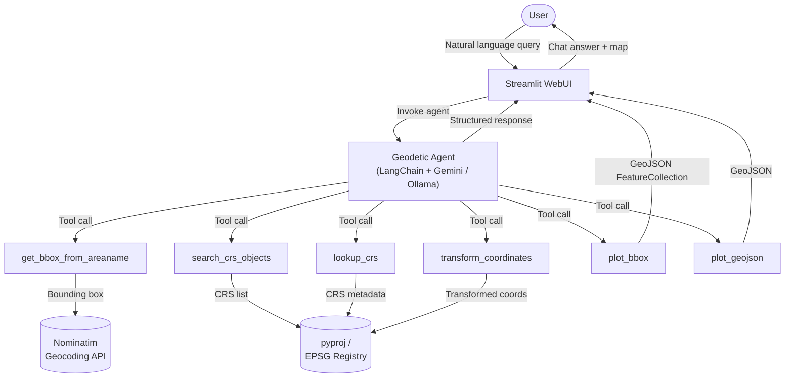

# Geodetic Advisor

> An intelligent conversational AI agent that puts deep geodetic expertise at your fingertips.

---

## Vision

Geodesy is foundational to every geospatial project, yet selecting the right coordinate reference system (CRS), datum, or map projection remains a specialized skill that takes years to master. **Geodetic AI-visor** closes that gap.

By combining a Large Language Model with a curated set of geodetic tools and the EPSG registry, the agent lets anyone — surveyors, GIS analysts, developers, students — ask plain-language questions and get authoritative, actionable geodetic answers.

**Goals:**
- Make CRS discovery and selection conversational
- Reduce errors caused by wrong datum or projection choices
- Provide transparent reasoning, not just answers
- Serve both operational and educational use cases

---

## Architecture



**Key components:**

| Layer | Technology |
|---|---|
| LLM | Google Gemini (`langchain-google-genai`) or Ollama local models (`langchain-ollama`) |
| Agent framework | LangChain |
| Geodetic engine | pyproj + EPSG registry |
| Geocoding | OpenStreetMap Nominatim |
| Web UI | Streamlit + pydeck |

---

## Tools

### `get_bbox_from_areaname`
Resolves a place name to a geographic bounding box using the Nominatim geocoding API.

| Parameter | Type | Description |
|---|---|---|
| `area_name` | `str` | Name of the geographic area (e.g., `"Argentina"`, `"Tokyo"`) |

**Returns:** `dict` with keys `west`, `south`, `east`, `north`

---

### `search_crs_objects`
Queries the EPSG registry for CRS objects matching an area, type, name, or area-of-use filter.

| Parameter | Type | Description |
|---|---|---|
| `bbox` | `dict` | Bounding box from `get_bbox_from_areaname` |
| `object_type` | `PJType` or `list` | Filter by type: `GEODETIC_REFERENCE_FRAME`, `PROJECTED_CRS`, `GEOGRAPHIC_CRS`, `VERTICAL_CRS`, … |
| `object_name` | `str` | Filter by CRS name substring |
| `object_area_of_use` | `str` | Filter by area-of-use name substring |

**Returns:** List of matching CRS objects from the EPSG registry.

---

### `lookup_crs`
Retrieves metadata for a specific EPSG code.

| Parameter | Type | Description |
|---|---|---|
| `epsg_code` | `str` | EPSG code, e.g. `"4326"` |

**Returns:** CRS name, datum, and area of use.

---

### `transform_coordinates`
Transforms a coordinate pair between two EPSG reference systems.

| Parameter | Type | Description |
|---|---|---|
| `query` | `str` | `"x,y,from_epsg,to_epsg"` — e.g., `"-58.417,-34.611,4326,32720"` |

**Returns:** Transformed `(x, y)` coordinates.

---

### `plot_bbox`
Plots a bounding box as a rectangular polygon on the interactive map.

| Parameter | Type | Description |
|---|---|---|
| `west` | `float` | Western longitude in decimal degrees |
| `south` | `float` | Southern latitude in decimal degrees |
| `east` | `float` | Eastern longitude in decimal degrees |
| `north` | `float` | Northern latitude in decimal degrees |
| `name` | `str` | Label shown in the map tooltip (default: `"Area"`) |

**Returns:** A GeoJSON `FeatureCollection` string representing the bounding-box polygon.

---

### `plot_geojson`
Plots an arbitrary GeoJSON object on the interactive map.

| Parameter | Type | Description |
|---|---|---|
| `geojson` | `str` | A valid RFC 7946 GeoJSON string — `Feature`, `FeatureCollection`, or any geometry type |

**Returns:** The original GeoJSON string if valid, or an error message.

---

## Usage Examples

### Find datums applicable to a region

```
User: What geodetic datums apply to Neuquén, Argentina?

Agent: I'll look that up for you.
  → get_bbox_from_areaname("Neuquén")  →  bbox: {west: -71.4, south: -41.0, east: -68.5, north: -36.9}
  → search_crs_objects(bbox=..., object_type=GEODETIC_REFERENCE_FRAME)

Results:
  • Campo Inchauspe (EPSG:4221) — historic Argentine datum
  • POSGAR 98 (EPSG:4190)       — national GPS-compatible datum
  • POSGAR 2007 (EPSG:5340)     — current official Argentine datum
  • WGS 84 (EPSG:4326)          — global GPS reference
```

---

### Look up a CRS by EPSG code

```
User: What is EPSG:32720?

Agent: → lookup_crs("32720")

EPSG:32720 - WGS 84 / UTM zone 20S
Datum: World Geodetic System 1984
Area of use: World - S hemisphere between 66°W and 60°W
```

---

### Transform coordinates between reference frames

```
User: Convert -58.417, -34.611 from WGS84 geographic to UTM zone 21S.

Agent: → transform_coordinates("-58.417,-34.611,4326,32721")

Transformed coordinates: (379,314.823614, 6,166,942.331708)
```

---

### Visualise a CRS area of use on the map

```
User: Show me the area covered by EPSG:32720 on the map.

Agent: → lookup_crs("32720")  →  west=-66, south=-80, east=-60, north=0
       → plot_bbox(west=-66, south=-80, east=-60, north=0, name="WGS 84 / UTM zone 20S")

[Interactive map updated with the bounding-box polygon]
```

---

## Getting Started

```bash
# Clone the repo
git clone https://github.com/your-username/geodetic-advisor-ai-agent.git
cd geodetic-advisor-ai-agent

# Install dependencies
uv sync

# Launch the web UI (defaults to Ollama local provider)
uv run streamlit run src/webui/app.py
```

The provider can be switched in the sidebar at runtime. For **Ollama** (default), make sure an Ollama server is running locally or set `OLLAMA_BASE_URL` to point to your server:

```bash
export OLLAMA_BASE_URL=http://localhost:11434   # Linux/macOS
$env:OLLAMA_BASE_URL="http://localhost:11434"   # Windows PowerShell
```

For **Google Gemini**, supply your API key via the sidebar or an environment variable:

```bash
export GEMINI_API_KEY=your_key_here   # Linux/macOS (also accepted as GOOGLE_API_KEY)
$env:GEMINI_API_KEY="your_key_here"   # Windows PowerShell
```

### Development

```bash
# Run tests
uv run pytest

# Lint
uv run ruff check
```
